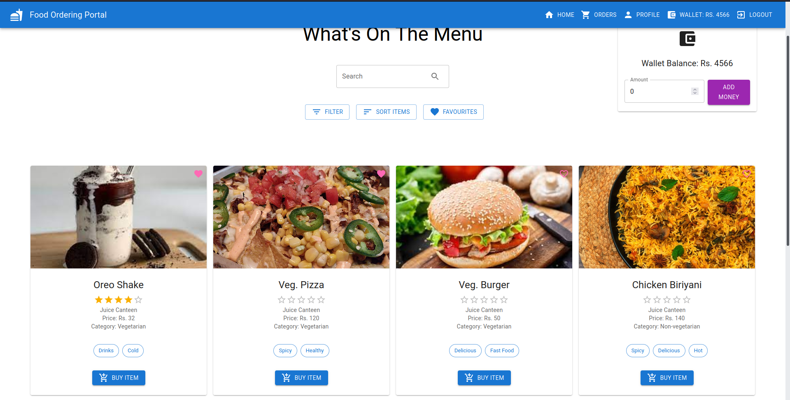

# Food Ordering Portal

<p align="center">

</p>

The Food Ordering Portal is a web application built using the MERN stack that allows:

<b>Customers</b>

* to order food items from a list of available items sold by vendors
* to view, manage and edit personal profiles
* to view status of orders placed by them and pick up orders from vendors

<b>Vendors</b>

* to put food items up for sale, where they can be ordered by customers
* to view, manage and edit personal profiles
* to view and manage orders placed by customers and update their status as the orders progress
* view statistics and distribution of orders placed by customers and sales completed by them

The Food Ordering Portal supports two types of accounts: vendors and customers.

## Features

* User authentication and authorization using JWT.
* Fuzzy search for food items
* Filtering and sorting food items based on various attributes
* Email confirmation for acceptance/rejection of orders
* Adding and removing favourite food items

## Requirements

* Node.js
* Express.js
* MongoDB
* React.js

## Setup

1. Clone the repository.

2. Change directory to the root of the repository.
```bash
cd Food-Ordering-Portal
```

### I. No-Docker Setup

#### Backend

1. From the cloned directory, run `cd backend` and run the following commands:
```bash
npm install
cp .env.template .env
```

2. Fill in the details in the newly created `.env` file, and save it. This is an essential step, as it contains the credentials for the database.

3. Then start the backend using the following command:
```bash
npm start
```

The backend will start on port 5000.

#### Frontend

1. From the cloned directory, run `cd frontend` and run the following commands:
```bash
npm install
```

2. Start the frontend using the following command:
```bash
npm start
```

The frontend will start on port 3000. Head over to http://localhost:3000 to view the application.

### II. Docker Setup

1. From the cloned directory, run `cd backend` and run the following command:
```bash
cp .env.template .env
```

2. Fill in the details in the newly created `.env` file, and save it. This is an essential step, as it contains the credentials for the database.

3. Now, all you need to do is run the following command from the root of the cloned directory:
```bash
cd ..
docker-compose up -d
```
The application will now be running on http://localhost:80.

Running
```bash
docker-compose down
```
will stop the application.